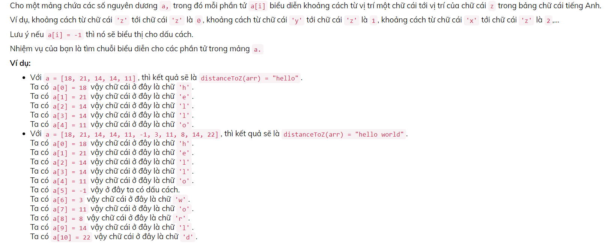
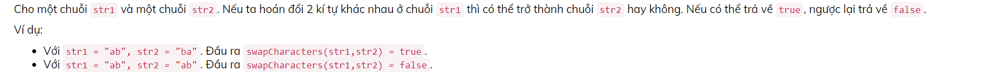

# Bài tập CodeLearn.io

1. **Bài 1: distance To Z** 
    
    #### **CASE** 
    |                                                                                                                                                           input                                                                                                                                                            |                                        output                                         |
    | :------------------------------------------------------------------------------------------------------------------------------------------------------------------------------------------------------------------------------------------------------------------------------------------------------------------------: | :-----------------------------------------------------------------------------------: |
    |                                                                                                                                                     18, 21, 14, 14, 11                                                                                                                                                     |                                         hello                                         |
    |                                                                                                                                          18, 21, 14, 14, 11, -1, 3, 11, 8, 14, 22                                                                                                                                          |                                      hello world                                      |
    |                                                                                                                                             23, 11, 22, 21, 14, 21, 25, 8, 12                                                                                                                                              |                                       codelearn                                       |
    |                                                                                                                               20, 7, 11, 20, 6, -1, 17, 12, -1, 6, 18, 21, -1, 12, 21, 3, 7                                                                                                                                |                                   fsoft in the news                                   |
    | 3, 18, 21, 12, -1, 1, 11, 5, -1, 3, 25, 12, 6, -1, 6, 11, -1, 6, 25, 15, 21, -1, 23,11, 12, 6, 8, 11, 14, -1, 11, 20, -1, 1, 11, 5, 8, -1, 14, 17, 20, 21, -1, 25, 12, 22, -1, 13, 25, 15, 21, -1, 6, 18, 21, -1, 13, 11, 7, 6, -1, 11, 20, -1, 21, 4, 21, 8, 1, 6, 18, 17, 12, 19, -1, 25, 8, 11, 5, 12, 22, -1, 1, 11, 5 | when you want to take control of your life and make the most of everything around you |

    [**Làm bài trên codelearn tại đây**](https://codelearn.io/training/detail/306752)

2. **Bài 2: swap Characters** 
    

    #### CASE
    | input     | output |
    | :-------- | -----: |
    | "ab","ba" |   true |
    | "ab","ab" | false |
    | "aaaaaaabc","aaaaaaacb" | true |
    | "pkovqorbheaosrbqkycuqnnvpaitmpooxsixbfoxcrfybautytmsspmgbqsfcvyhmduphjomdbfvytqgkwtbuqigfqnpcxahrmdhlmvqfktsydhshhbnfipniuebtmbcemndymqtmmunlekinoaewscsgdysefadirbpvjnftsfapbrlyertsipepycahtobyiahpuuccrkingffcsryauwhkddtwroagvksdggvtobkytbcguksnkiiflbwpbgtnpvcditkjhffndlrswwjpthoxmwvnnifclftdgogtxooiiqjxrschcbppqkrfordvhvpballsssnjxqoixhbbuxjbbgyaawcsfvffnirumdkfingmrbecwsphrllljynnthmgqnhbngmdctyggsblymrifwskhtvuorookpqsitavqcxdsvovefknkseosxugwvldqjixtphpwalydeiffyprfknbeflhecewwvkybvtwwtkthjislyhrdonulsfpbtdqhekmluarbnthqlwackuhchityiuqhsoodooqsyxvbeieuxaapwwugaqtrxvpkkcrserqtgahrgksxgkaigousqqdoejurimrufawyooqbwjdwhddhycpqtsyadbxnwmodnankxcxdgemiswaniuwwcqksxcisjyjjmoancwlhxwnmggwwfafgkwgnsipcluutkqfjncnkfmmrltxncscokfrbjchvlfniexpdeygqbnqbvkkgxwkfhjpeudpyhkgsvepuevmhxkbflpastnkdycauowxbuwqteasiucsrkamwkkytbrmawejtghiirrndupqdqytqbdehuxpwahpdlbilqrjeahwuktkrbyitpdtylokpxaplourocuqfovbkbvvmmraxfnojddoydkifaxhcwwqpapyajicenjwvpthcugfmwbjrrllenxjcdlsmrapdllovkbluxdeaiqtukfljdiwqsfbuav","pkovqorbheaosrbqkycuqnnvpaitmpooxsixbfoxcrfybautytmsspmgbqsfcvyhmduphjomdbfvytqgkwtbuqigfqnpcxahrmdhlmvqfktsydhshhbnfipniuebtmbcemndymqtmmunlekinoaewscsgdysefadirbpvjnftsfapbrlyertsipepycahtobyiahpuuccrkingffcsryauwhkddtwroagvksdggvtobkytbcguksnkiiflbwpbgtnpvcditkjhffndlrswwjpthoxmwvnnifclftdgogtxooiiqjxrschcbppqkrfordvhvpballsssnjxqoixhbbuxjbbgyaawcsfvffnirumdkfingmrbecwsphrllljynnthmgqnhbngmdctyggsblymrifwskhtvuorookpqsitavqcxdsvovefknkseosxugwvldqjixtphpwalydeiffyprfknbeflhecewwvkybvtwwtkthjislyhrdonulsfpbtdqhekmluarbnthqlwackuhchityiuqhsoodooqsyxvbeieuxaapwwugaqtrxvpkkcrserqtgahrgksxgkaigousqqdoejurimrufawyooqbwjdwhddhycpqtsyadbxnwmodnankxcxdgemiswaniuwwcqksxcisjyjjmoancwlhxwnmggwwfafgkwgnsipcluutkqfjncnkfmmrltxncscokfrbjchvlfniexpdeygqbnqbvkkgxwkfhjpeudpyhkgsvepuevmhxkbflpastnkdycauowxbuwqteasiucsrkamwkkytbrmawejtghiirrndupqdqytqbdehuxpwahpdlbilqrjeahwuktkrbyitpdtylokpxaplourocuqfovskbvvmmraxfnojddoydkifaxhcwwqpapyajicenjwvpthcugfmwbjrrllenxjcdlsmrapdllovkbluxdeaiqtukfljdiwqbfbuav" | true |
    | "vttnefvsvqgbbnpgayllxuwyqibctmuaabgfifhjgrpofdcomfccxalqaoqbwrvxvcbfibcciajurdfckdsqpxkmquwvrfmvkytjxkvorhfkxswslaxwujrerchfhonqjwgphygpfrtvpbjjccqdlevkvpifrhajufnsbpsglsefmisychklkmqawinomrjexqcoiitibtasabgdqkituoprwscgexlldgadailadpmlwjkfbgkolbdgwvwdfetspckrbwjfxlsjxsxlipmogrspxhbieriwgnrxhbkeuawfjmgyliwhdufxsvhcrtqyrrmxuqhbemvfhxapodruvppfkacxejasadneunpyxwpnqqioqvexxxttjgnhmffraftbllqtqjixqbtnwjjdmdrgejtkdoqwsyifkocqgaqayxononbjnqspmwxlfunartsmbtbgpwomgdqnrnlxuoogbxcjdncsdxvqgjdpvmifqirvmkebpwtahssmoixjycqvbrrvldrpcnmqehrdghuukalsbgewgfpwctegskaikowdkboaueykryouywaenloijbarqpnaobfhlblkipdtaiqwdroxwfxoqojakogcpavyhaaolwpiinqefnqqqiklaogpdgvoobovixpvjrvcyevannoaqejnofxgklrmylpyhuwkombfibdmalowwqwxjytnurvynwpfxrhyblwtajnfpvurjrqgfvlmakdtcbrbxxbimhmfrhuttpugcwpimgnduhpwewrqthpfqxroggpbebxvacnhtgxvodufnkxebooqaoiwraniaudrqlrtlmglqyewicchgsmsviuwjlhqucewmealuycbsnidlnhdlsjytiafyiewjyhnolukbgpkkvlsxljynfsjlsbeoemuicfkrpcysccghqdbakqkqiccselofqeleohnudbjnwjrjmgiswtufiyhxtdcnxmimqwsmibxneog" , "vttnefvsvqgbbnpgayllxuwyqibctmuaabgfifhjgrpofdcomfccxalqaoqbwrvxvcbfibcciajurdfckdsqpxkmquwvrfmvkytjxkvorhfkxswslaxwujrerchfhonqjwgphygpfrtvpbjjccqdlevkvpifrhajufnsbpsglsefmisychklkmqawinomrjexqcoiitibtasabgdqkituoprwscgexlldgadailadpmlwjkfbgkolbdgwvwdfetspckrbwjfxlsjxsxlipmogrspxhbieriwgnrxhbkeuawfjmgyliwhdufxsvhcrtqyrrmxuqhbemvfhxapodruvppfkacxejasadneunpyxwpnqqioqvexxxttjgnhmffraftbllqtqjixqbtnwjjdmdrgejtkdoqwsyifkocqgaqayxononbjnqspmwxlfunartsmbtbgpwomgdqnrnlxuoogbxcjdncsdxvqgjdpvmifqirvmkebpwtahssmoixjycqvbrrvldrpcnmqehrdghuukalsbgewgfpwctegskaikowdkboaueykryouywaenloijbarqpnaobfhlblkipdtaiqwdroxwfxoqojakogcpavyhaaolwpiinqefnqqqiklaogpdgvoobovixpvjrvcyevannoaqejnofxgklrmylpyhuwkombfibdmalowwqwxjytnurvynwpfxrhyblwtajnfpvurjrqgfvlmakdtcbrbxxbimhmfrhuttpugcwpimgnduhpwewrqthpfqxroggpbebxvacnhtgxvodufnkxebooqaoiwraniaudrqlrtlmglqyewicchgsmsviuwjlhqucewmealuycbsnidlnhdlsjytiafyiewjyhnolukbgpkkvlsxljynfsjlsbeoemuicfkrpcysccghqdbakqkqiccselofqeleohnudbjnwjrjmgiswtufiyhxtdcnxmimqwsmilxneog" | false |

    [**Làm bài trên codelearn tại đây**](https://codelearn.io/training/detail/2501088)